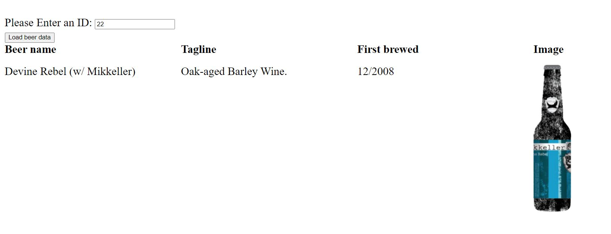

# PROFORMA - INTROPROG 2022a

_Mars 2022_

> 🔨 Bienvenue sur le Github du cours Javascript de la formation Introprog.
> Vous trouverez ici les ressources nécessaires pour le suivi du cours: théorie,
> exercices (et corrigés)...
>
> Votre formateur, Vincent Chilot

---

## Programme

On a qu'un jour et demi pour voir Javascript.

Il y aura un peu de [théorie](01-theorie)...

Ainsi qu'une série [d'exercices](02-parcours-web) qui challengeront vos talents de développeurs.

